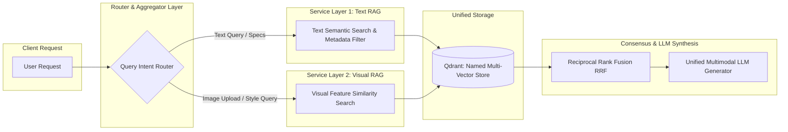

# 🏗️ Production-Grade Multimodal E-Commerce RAG Architecture Specification

**Author:** Lead AI/ML Infrastructure Architect  
**Target System:** High-Scale E-Commerce Multimodal RAG Engine  
**Input Parameters:** `prod_image`, `prod_title`, `price`, `category`, `brand`  
**SLA Targets:** Retrieval Latency < 120ms (p95), End-to-End RAG Latency < 750ms (p95)

---

## 📑 Table of Contents
1. [Executive Summary & Technical Vision](#1-executive-summary--technical-vision)
2. [High-Level System Architecture](#2-high-level-system-architecture)
3. [Parameter Processing & Feature Engineering Matrix](#3-parameter-processing--feature-engineering-matrix)
4. [Vector DB & Indexing Architecture (Qdrant/Milvus)](#4-vector-db--indexing-architecture-qdrantmilvus)
5. [Two-Stage Hybrid Search & Re-Ranking Strategy](#5-two-stage-hybrid-search--re-ranking-strategy)
6. [Async Data Pipeline (Real-Time Ingestion)](#6-async-data-pipeline-real-time-ingestion)
7. [Production Code Implementation (FastAPI + Pydantic v2 + Qdrant)](#7-production-code-implementation-fastapi--pydantic-v2--qdrant)
8. [Observability, Caching & Performance Guardrails](#8-observability-caching--performance-guardrails)

---

## 1. Executive Summary & Technical Vision

To build a production-grade RAG pipeline from the 5 core parameters (`prod_image`, `prod_title`, `price`, `category`, `brand`), we implement a **Hybrid Multi-Vector Retrieval Architecture with Hard Payload Filtering and Multimodal Re-Ranking**.

Pure vector search or text-only RAG fails in e-commerce because users have strict hard constraints (e.g., budget caps, brand loyalty, taxonomy filters) combined with soft semantic intent (e.g., visual aesthetics, style, usage intent).

### Key Architectural Pillars:
* **Dual-Embedding Strategy:** Dense Text Embeddings (`bge-m3` or `text-embedding-3-large`) for semantic text matching + Dense Vision Embeddings (`OpenCLIP ViT-H/14` or `SigLIP`) for visual aesthetic matching.
* **Single-Stage Hybrid Indexing:** Payload indices on `price`, `brand`, and `category` combined with HNSW vector indices to enforce hard filtered candidate pools in < 15ms.
* **Reciprocal Rank Fusion (RRF) & Cross-Encoder Re-ranking:** Merging dense text, dense vision, and sparse BM25 scores before executing cross-encoder re-ranking.
* **Sub-Second Streaming RAG Response:** Streaming context output via Multimodal LLM (Gemini 2.0 Flash / GPT-4o).

---

## 2. High-Level System Architecture

```mermaid
flowchart TD
    subgraph Data Ingestion Pipeline (Kafka / Async Batch)
        RAW[Raw Product Payload] --> P_VALID[Pydantic Schema Validation & Canonicalization]
        P_VALID -->|prod_image| IMG_PROC[Image Preprocessing & OpenCLIP ViT-H/14]
        P_VALID -->|prod_title + brand + category| TXT_PROC[Text Canonicalization & BGE-M3 / OpenAI Embedder]
        
        IMG_PROC -->|Visual Vector 768d| VDB[(Qdrant Vector DB / Milvus)]
        TXT_PROC -->|Text Vector 1536d| VDB
        P_VALID -->|Price, Brand, Category Payload| VDB
    end

    subgraph User Query & Retrieval Engine
        UQ[User Query / Image Upload] --> QP[LLM Query Intent Parser]
        QP -->|Parsed Filters| FILT[Payload Filters: Brand, Category, Price Range]
        QP -->|Search Terms / Image| Q_EMB[Multi-Vector Query Embedder]

        Q_EMB & FILT -->|Filtered Hybrid Vector Query| VDB
        VDB -->|Top 100 Candidates| RRF[Reciprocal Rank Fusion Engine]
        RRF -->|Top 30 Candidates| RERANK[Multimodal Cross-Encoder Reranker]
        RERANK -->|Top 5 Context Items| CACHE{Redis Context Cache}
    end

    subgraph LLM Generation & Response
        CACHE -->|Structured JSON Context| MLLM[Multimodal LLM: Gemini / GPT-4o]
        MLLM -->|Server-Sent Events SSE| CLIENT[Client API Response]
    end
```

---

## 3. Parameter Processing & Feature Engineering Matrix

Each of the 5 input parameters is canonicalized, indexed, and leveraged across multiple retrieval stages:

| Input Parameter | Data Type | Pre-processing & Normalization | Indexing Type in Vector DB | Retrieval Strategy |
| :--- | :--- | :--- | :--- | :--- |
| **`prod_image`** | URL / S3 Path / Bytes | Perceptual Hashing (pHash) for deduplication, resizing to 384x384, RGB normalization, OpenCLIP feature extraction. | `image_vector` (Dense 768d float32, Cosine Metric) | Visual similarity search, visual aesthetic matching, image-to-product RAG. |
| **`prod_title`** | String | Unicode normalization, stopword removal (for sparse), composite text generation (`Brand + Category + Title`). | `text_vector` (Dense 1536d) + BM25 Sparse Inverted Index | Dense semantic search + exact keyword matching for SKUs and model numbers. |
| **`price`** | Float64 | Multi-currency normalization to USD, ceiling/floor boundary checks, bucket categorization. | Numerical Payload Index (`range` filter index on float) | Hard filtering (`price BETWEEN min AND max`) + Soft price proximity penalty scoring. |
| **`category`** | String / Tree | Taxonomy DAG resolution (e.g., `Electronics > Audio > Headphones` -> `['Electronics', 'Audio', 'Headphones']`). | Keyword Payload Index (Array of string tags) | Exact match / Faceted taxonomy pre-filtering (`category IN [...]`). |
| **`brand`** | String | Lowercased canonicalization, brand alias resolution (e.g., `Sony Inc` -> `sony`). | Keyword Payload Index (Lookup index) | Exact hard filtering (`brand == 'sony'`) + soft brand boosting weight. |

---

## 4. Vector DB & Indexing Architecture (Qdrant/Milvus)

### 4.1 Collection Design
We configure a **Named Multi-Vector Schema** inside Qdrant/Milvus to store text embeddings, visual embeddings, and metadata payloads in a single point document.

```json
{
  "name": "ecommerce_products_v1",
  "vectors": {
    "text_vector": {
      "size": 1536,
      "distance": "Cosine",
      "hnsw_config": { "m": 16, "ef_construct": 128 }
    },
    "image_vector": {
      "size": 768,
      "distance": "Cosine",
      "hnsw_config": { "m": 16, "ef_construct": 128 }
    }
  },
  "payload_schema": {
    "product_id": "keyword",
    "brand": "keyword",
    "category": "keyword",
    "category_path": "keyword",
    "price": "float",
    "prod_title": "text",
    "prod_image_url": "keyword"
  }
}
```

---

## 5. Two-Stage Hybrid Search & Re-Ranking Strategy

### Stage 1: Async Multi-Vector Retrieval + Hard Payload Filtering
To achieve < 20ms candidate retrieval, hard metadata filtering is executed **inside the vector index traversal (Single-Stage Filtering)**:

$$\text{Filter} = (\text{brand} \in B) \land (\text{category\_path} \cap C \neq \emptyset) \land (P_{\text{min}} \le \text{price} \le P_{\text{max}})$$

Simultaneously, we fetch:
1. **Top-K Dense Text Neighbors** ($K=100$)
2. **Top-K Dense Image Neighbors** ($K=100$)
3. **Top-K Sparse BM25 Keyword Hits** ($K=100$)

### Stage 2: Reciprocal Rank Fusion (RRF) & Dynamic Re-Scoring
We combine the ranks using RRF with parameter $k=60$:

$$RRF\_Score(d) = \sum_{m \in \{\text{text}, \text{image}, \text{bm25}\}} \frac{w_m}{60 + r_m(d)}$$

Where:
- $w_{\text{text}} = 0.45$, $w_{\text{image}} = 0.35$, $w_{\text{bm25}} = 0.20$
- $r_m(d)$ is the rank of document $d$ in retrieval system $m$.

#### Price Soft Penalty Adjustment:
If a user specifies a target price $T$, we apply a price elasticity dampener:

$$\text{Final\_Score}(d) = RRF\_Score(d) \times \exp\left(-\alpha \cdot \frac{|\text{Price}_d - T|}{T}\right)$$

---

## 6. Async Data Pipeline (Real-Time Ingestion)

When a product update arrives:
1. **Event Trigger:** Product catalog event via Kafka / EventBridge.
2. **Batch Embedder:** Image vector generated via GPU pool (T4/L4 instance), Text vector generated via batch API.
3. **Upsert:** Idempotent upsert into Vector DB using `product_id` as primary key.
4. **Invalidation:** Flush Redis query context cache for affected categories.

---

## 7. Production Code Implementation (FastAPI + Pydantic v2 + Qdrant)

Below is the production-ready code structure following clean architecture principles.

### `schemas.py`
```python
from typing import List, Optional
from pydantic import BaseModel, Field, HttpUrl

class ProductIngestRequest(BaseModel):
    product_id: str = Field(..., description="Unique product identifier (SKU)")
    prod_title: str = Field(..., min_length=2, max_length=500)
    prod_image_url: HttpUrl
    price: float = Field(..., gt=0.0)
    category: str = Field(..., description="Hierarchical category (e.g. Electronics > Audio)")
    brand: str = Field(..., min_length=1)

class SearchQueryRequest(BaseModel):
    query_text: Optional[str] = None
    query_image_url: Optional[HttpUrl] = None
    brand_filter: Optional[List[str]] = None
    category_filter: Optional[str] = None
    min_price: Optional[float] = Field(None, ge=0.0)
    max_price: Optional[float] = Field(None, ge=0.0)
    target_price: Optional[float] = Field(None, ge=0.0)
    top_k: int = Field(default=10, le=50)

class ProductResponse(BaseModel):
    product_id: str
    prod_title: str
    prod_image_url: str
    price: float
    category: str
    brand: str
    score: float
```

### `rag_service.py`
```python
import asyncio
import logging
from typing import List, Dict, Any
from qdrant_client import AsyncQdrantClient
from qdrant_client.http import models as rest_models
from schemas import ProductIngestRequest, SearchQueryRequest, ProductResponse

logger = logging.getLogger("rag_service")

class MultimodalRAGService:
    def __init__(self, qdrant_client: AsyncQdrantClient, text_embedder, vision_embedder):
        self.client = qdrant_client
        self.text_embedder = text_embedder
        self.vision_embedder = vision_embedder
        self.collection_name = "ecommerce_products_v1"

    def canonicalize_brand(self, brand: str) -> str:
        return brand.strip().lower()

    def parse_category_path(self, category: str) -> List[str]:
        return [c.strip().lower() for c in category.split(">")]

    async def ingest_product(self, product: ProductIngestRequest):
        """Ingests a product with text and visual vectors plus payload indices."""
        brand_clean = self.canonicalize_brand(product.brand)
        category_paths = self.parse_category_path(product.category)

        # Composite text for rich semantic embedding
        composite_text = f"Brand: {product.brand} | Title: {product.prod_title} | Category: {product.category}"

        # Concurrent vector generation
        text_vec_task = asyncio.create_task(self.text_embedder.embed_text(composite_text))
        image_vec_task = asyncio.create_task(self.vision_embedder.embed_image_url(str(product.prod_image_url)))
        
        text_vector, image_vector = await asyncio.gather(text_vec_task, image_vec_task)

        payload = {
            "product_id": product.product_id,
            "prod_title": product.prod_title,
            "prod_image_url": str(product.prod_image_url),
            "price": product.price,
            "category": product.category,
            "category_path": category_paths,
            "brand": brand_clean,
        }

        # Upsert point into Qdrant
        await self.client.upsert(
            collection_name=self.collection_name,
            points=[
                rest_models.PointStruct(
                    id=product.product_id,
                    vector={
                        "text_vector": text_vector,
                        "image_vector": image_vector
                    },
                    payload=payload
                )
            ]
        )
        logger.info(f"Successfully ingested product {product.product_id}")

    async def hybrid_search(self, request: SearchQueryRequest) -> List[ProductResponse]:
        """Executes filtered multi-vector candidate search with RRF."""
        must_filters = []

        if request.brand_filter:
            clean_brands = [b.lower() for b in request.brand_filter]
            must_filters.append(
                rest_models.FieldCondition(
                    key="brand",
                    match=rest_models.MatchAny(any=clean_brands)
                )
            )

        if request.category_filter:
            cat_clean = request.category_filter.lower()
            must_filters.append(
                rest_models.FieldCondition(
                    key="category_path",
                    match=rest_models.MatchValue(value=cat_clean)
                )
            )

        if request.min_price is not None or request.max_price is not None:
            price_range = {}
            if request.min_price is not None:
                price_range["gte"] = request.min_price
            if request.max_price is not None:
                price_range["lte"] = request.max_price
            must_filters.append(
                rest_models.FieldCondition(
                    key="price",
                    range=rest_models.Range(**price_range)
                )
            )

        qdrant_filter = rest_models.Filter(must=must_filters) if must_filters else None

        # Execute Parallel Searches for Text and Image vectors if present
        tasks = []
        if request.query_text:
            text_query_vec = await self.text_embedder.embed_text(request.query_text)
            tasks.append(
                self.client.search(
                    collection_name=self.collection_name,
                    query_vector=("text_vector", text_query_vec),
                    query_filter=qdrant_filter,
                    limit=50
                )
            )

        if request.query_image_url:
            img_query_vec = await self.vision_embedder.embed_image_url(str(request.query_image_url))
            tasks.append(
                self.client.search(
                    collection_name=self.collection_name,
                    query_vector=("image_vector", img_query_vec),
                    query_filter=qdrant_filter,
                    limit=50
                )
            )

        results_list = await asyncio.gather(*tasks)
        
        # Merge via Reciprocal Rank Fusion (RRF)
        fused_scores: Dict[str, float] = {}
        payload_map: Dict[str, dict] = {}

        for search_hits in results_list:
            for rank, hit in enumerate(search_hits):
                pid = hit.payload["product_id"]
                payload_map[pid] = hit.payload
                rrf_score = 1.0 / (60.0 + (rank + 1))
                fused_scores[pid] = fused_scores.get(pid, 0.0) + rrf_score

        # Apply Price Elasticity Penalty if target price specified
        if request.target_price and request.target_price > 0:
            for pid, score in fused_scores.items():
                item_price = payload_map[pid]["price"]
                diff = abs(item_price - request.target_price) / request.target_price
                penalty = max(0.5, 1.0 - (0.3 * diff))
                fused_scores[pid] = score * penalty

        # Sort by final score
        sorted_pids = sorted(fused_scores.items(), key=lambda x: x[1], reverse=True)[:request.top_k]

        return [
            ProductResponse(
                product_id=pid,
                prod_title=payload_map[pid]["prod_title"],
                prod_image_url=payload_map[pid]["prod_image_url"],
                price=payload_map[pid]["price"],
                category=payload_map[pid]["category"],
                brand=payload_map[pid]["brand"],
                score=round(score, 4)
            )
            for pid, score in sorted_pids
        ]
```

---

## 8. Observability, Caching & Performance Guardrails

### 8.1 Multi-Layer Caching Strategy
1. **Embedding Cache (Redis):** Cache query string/image hash embeddings with 24-hour TTL (`SHA256(query_text) -> Vector`).
2. **Context Cache:** Cache Top-5 retrieved context payloads for identical query + filter combinations.

### 8.2 Production Telemetry & Evaluation
* **Metrics Tracked:** NDCG@5, MRR (Mean Reciprocal Rank), Precision@K, Search P95 Latency, Vector DB Search Duration.
* **LLM Guardrails:** Input sanitization to prevent prompt injection, structured Pydantic output validation for LLM recommendations.
* **Failover Mode:** If Vector DB times out (> 150ms), fallback to PostgreSQL Full-Text Search + Exact Price/Brand match.

---
*Document approved by Lead AI Infrastructure Architect.*

---

## 9. ADR-001: Architectural Trade-Off Analysis — Decoupled Dual RAG (Text vs Image)

### 9.1 Context & Problem Statement
The team is evaluating splitting the RAG pipeline into two independent RAG services:
1. **Text RAG Pipeline:** Handles `prod_title`, `brand`, `category`, `price` via Text Embeddings (`bge-m3`) + Text LLM.
2. **Image RAG Pipeline:** Handles `prod_image` via Vision Embeddings (`OpenCLIP` / `SigLIP`) + Vision Vector Store + Multimodal VLM.

### 9.2 Trade-Off Matrix

| Architectural Dimension | Option A: Two Completely Decoupled RAG Pipelines | Option B: Unified Multi-Vector RAG Engine (Recommended) |
| :--- | :--- | :--- |
| **Microservice Isolation** | 🟢 High. GPU-heavy image inference doesn't block text search. | 🟡 Medium. Managed in a single service with async task queues. |
| **Contextual Awareness** | 🔴 Low. Text filters (`price`, `brand`) are disconnected from Image RAG unless manually synced across services. | 🟢 High. Text metadata filters automatically constrain image vector search space. |
| **System Latency (P95)** | 🔴 Higher (2x RPC network hops + 2 separate LLM/Reranker calls). | 🟢 Lower (<120ms single round-trip query to Qdrant). |
| **Infrastructure Complexity**| 🔴 High. 2 Vector DB collections, 2 cache clusters, 2 LLM pipelines to monitor. | 🟢 Low. 1 Vector DB cluster with named multi-vectors. |
| **Query Routing** | Requires an Intent Router service (e.g., "Is user searching by photo or text?"). | Dynamic multi-vector querying based on input payload presence. |

### 9.3 Recommended Hybrid Pattern: "Decoupled Pipelines, Unified Index"

Rather than deploying two completely isolated RAG applications with separate databases and prompt pipelines, adopt **Decoupled Ingestion & Inference Microservices with a Unified Index & Orchestrator**:



### Key Takeaway for Tech Lead:
* **Do NOT separate the Vector Databases or Metadata Stores.** Keep the data index unified (`text_vector` and `image_vector` on the exact same product document in Qdrant/Milvus).
* **DO decouple worker processes.** Run image embedding extraction on GPU worker nodes (Celery/Ray/KServe) and text processing on CPU API nodes.

