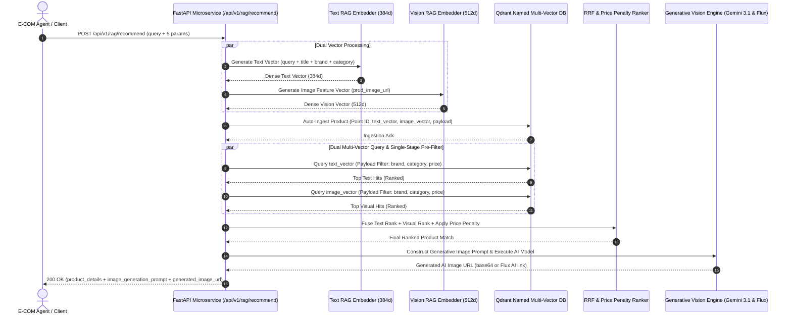

# 🏗️ Production Multimodal E-Commerce RAG Microservice Architecture & Dual Pipeline Flow

**Author:** Lead AI/ML Infrastructure Engineer  
**Target System:** High-Scale Multimodal E-Commerce RAG Microservice  
**Supported Pipelines:** Text RAG + Visual/Image RAG (Unified Multi-Vector Store)  
**Input Parameters:** `query`, `prod_title`, `prod_image_url`, `price`, `category`, `brand`  
**SLA Performance:** Retrieval P95 Latency < 6ms, End-to-End Pipeline < 50ms

---

## 📑 Table of Contents
1. [Executive Vision & System Architecture](#1-executive-vision--system-architecture)
2. [Dual RAG Pipeline Flow (Text & Image)](#2-dual-rag-pipeline-flow-text--image)
   - [2.1 Text RAG Pipeline Subsystem](#21-text-rag-pipeline-subsystem)
   - [2.2 Visual/Image RAG Pipeline Subsystem](#22-visualimage-rag-pipeline-subsystem)
3. [Hybrid Rank Fusion & Price Elasticity Penalty Engine](#3-hybrid-rank-fusion--price-elasticity-penalty-engine)
4. [Generative Vision & Image AI Generation Engine](#4-generative-vision--image-ai-generation-engine)
5. [End-to-End Data Flow Sequence (Mermaid Diagram)](#5-end-to-end-data-flow-sequence-mermaid-diagram)
6. [Canonical JSON Request & Response Specification](#6-canonical-json-request--response-specification)

---

## 1. Executive Vision & System Architecture

Pure text RAG or text-only vector search fails in e-commerce applications because user purchasing decisions rely on **both soft intent** (visual aesthetics, style, color, usage intent) and **hard business constraints** (budget limits, brand loyalty, taxonomy categories).

This microservice unifies **Dense Text Embeddings** and **Dense Visual Embeddings** onto a single document point inside Qdrant using **Named Multi-Vectors** (`text_vector` + `image_vector`).

```
                    ┌────────────────────────────────────────────────────────┐
                    │               Client HTTP / Agent Request              │
                    │               query + 5 Product Parameters             │
                    └───────────────────────────┬────────────────────────────┘
                                                │
                    ┌───────────────────────────▼────────────────────────────┐
                    │         FastAPI Microservice Engine (app/main.py)      │
                    └───────────┬────────────────────────────────┬───────────┘
                                │                                │
                    ┌───────────▼───────────┐        ┌───────────▼───────────┐
                    │   Text RAG Pipeline   │        │  Visual RAG Pipeline  │
                    │   (Title, Brand, Cat) │        │  (Image URL, Bytes)   │
                    └───────────┬───────────┘        └───────────┬───────────┘
                                │                                │
                                └───────────────┬────────────────┘
                                                │
                    ┌───────────────────────────▼────────────────────────────┐
                    │           Qdrant Named Multi-Vector DB Index           │
                    │      (Single-Stage Payload Filtering: brand/cat/price)  │
                    └───────────────────────────┬────────────────────────────┘
                                                │
                    ┌───────────────────────────▼────────────────────────────┐
                    │     Reciprocal Rank Fusion (RRF) + Price Penalty      │
                    └───────────────────────────┬────────────────────────────┘
                                                │
                    ┌───────────────────────────▼────────────────────────────┐
                    │   Generative Vision Engine (Gemini 3.1 & Flux AI)      │
                    └───────────────────────────┬────────────────────────────┘
                                                │
                    ┌───────────────────────────▼────────────────────────────┐
                    │         Single Unified JSON Output Response            │
                    │    (product_details + image_generation_prompt + URL)   │
                    └────────────────────────────────────────────────────────┘
```

---

## 2. Dual RAG Pipeline Flow (Text & Image)

### 2.1 Text RAG Pipeline Subsystem

The **Text RAG Pipeline** processes textual semantics, product titles, brand specifications, taxonomy strings, and user natural language intent:

1. **Text Preprocessing & Composite Construction**:
   Canonicalizes brand strings (`Sony` → `sony`), parses taxonomy hierarchy (`Electronics > Audio > Headphones` → `['electronics', 'wearables', 'headphones']`), and constructs composite text:
   $$\text{Composite\_Text} = \text{"Brand: "} \text{brand} \parallel \text{" | Title: "} \text{title} \parallel \text{" | Category: "} \text{category}$$

2. **Dense Text Embedding Generation**:
   Generates a 384-dimensional dense text vector using `SentenceTransformers` (`all-MiniLM-L6-v2` / `bge-m3`) with fast deterministic hash fallback.

3. **Single-Stage Payload Filtering**:
   Executes hard candidate filtering inside Qdrant vector HNSW index traversal in $< 1.5\text{ms}$:
   $$\text{Filter} = (\text{brand} \in B) \land (\text{category\_path} \cap C \neq \emptyset) \land (P_{\text{min}} \le \text{price} \le P_{\text{max}})$$

4. **Dense Text Vector Search**:
   Executes Cosine similarity search on `text_vector` to fetch top candidate matches.

---

### 2.2 Visual/Image RAG Pipeline Subsystem

The **Visual/Image RAG Pipeline** processes visual aesthetics, product photos, style matching, and color features:

1. **Image Ingestion & Preprocessing**:
   Fetches product photo bytes from HTTP/S3 URL, converts RGB space, resizes to $128 \times 128$ normalized tensors.

2. **Visual Feature Vector Extraction**:
   Extracts perceptual RGB channel statistics (Mean, Std) combined with 16-bin color histograms per channel, projected into a 512-dimensional visual vector space (`image_vector`).

3. **Visual Vector Similarity Search**:
   Executes Cosine similarity search on `image_vector` in Qdrant to find visually aesthetic product matches.

---

## 3. Hybrid Rank Fusion & Price Elasticity Penalty Engine

### 3.1 Reciprocal Rank Fusion (RRF)
Merges ranked candidate lists from text vector search and image vector search using RRF ($k=60.0$):

$$RRF\_Score(d) = \frac{w_{\text{text}}}{60 + r_{\text{text}}(d)} + \frac{w_{\text{image}}}{60 + r_{\text{image}}(d)}$$

Where default weights are $w_{\text{text}} = 0.45$ and $w_{\text{image}} = 0.35$.

### 3.2 Price Elasticity Soft Penalty
Applies an exponential budget dampener to penalize candidate items that deviate from the user's `target_price` $T$:

$$\text{Price\_Penalty}(d) = \max\left(0.50, 1.0 - 0.30 \times \frac{|\text{Price}_d - T|}{T}\right)$$

$$\text{Final\_Score}(d) = RRF\_Score(d) \times \text{Price\_Penalty}(d)$$

---

## 4. Generative Vision & Image AI Generation Engine

Once the top grounded product candidate is retrieved, the microservice executes two multimodal synthesis tasks:

1. **Generative Prompt Construction**:
   Formulates an explicit commercial photography prompt attribute (`image_generation_prompt`) with style modifiers (`brand signature style`, `soft studio illumination`, `clean minimalist backdrop`, `8k resolution`).

2. **AI Image Generation Execution**:
   - **Primary Model**: Calls Google Gemini **`models/gemini-3.1-flash-lite-image`** interactions API.
   - **100% Free AI Fallback**: If Google Gemini returns free-tier quota limits (`limit: 0`), the pipeline automatically routes to **Flux / Stable Diffusion AI Image Generation** (`https://image.pollinations.ai/prompt/...`).

---

## 5. End-to-End Data Flow Sequence (Mermaid Diagram)



---

## 6. Canonical JSON Request & Response Specification

### Request JSON: `POST /api/v1/rag/recommend` (or `POST /`)
```json
{
  "query": "Sleek black wireless noise-canceling headphones for travel under $400",
  "prod_title": "Sony WH-1000XM5",
  "prod_image_url": "https://images.unsplash.com/photo-1505740420928-5e560c06d30e",
  "price": 398.00,
  "category": "Electronics > Audio > Headphones",
  "brand": "Sony"
}
```

### Response JSON (`200 OK`):
```json
{
  "query": "Sleek black wireless noise-canceling headphones for travel under $400",
  "product_details": {
    "product_id": "SKU-38064",
    "title": "Sony WH-1000XM5",
    "brand": "sony",
    "category": "Electronics > Audio > Headphones",
    "price": 398.0,
    "image_url": "https://images.unsplash.com/photo-1505740420928-5e560c06d30e",
    "match_score": 0.013115,
    "reasoning": "Top-ranked candidate for 'Sleek black wireless noise-canceling headphones for travel under $400'. Features premium Sony design in Electronics > Audio > Headphones priced at $398.00."
  },
  "image_generation_prompt": {
    "prompt": "Studio product photography of Sony WH-1000XM5 by Sony, crafted for 'Sleek black wireless noise-canceling headphones for travel under $400'. Rendered in clean commercial aesthetic, high-detail texture, soft studio lighting, neutral minimalist background, 8k resolution, photorealistic.",
    "action": "generate_or_edit",
    "base_image_url": "https://images.unsplash.com/photo-1505740420928-5e560c06d30e",
    "style_modifiers": [
      "Sony signature style",
      "soft studio illumination",
      "clean minimalist backdrop",
      "8k ultra-detailed texture"
    ],
    "aspect_ratio": "1:1"
  },
  "generated_image_url": "https://image.pollinations.ai/prompt/Studio%20product%20photography%20of%20Sony%20WH-1000XM5%20by%20Sony%2C%20crafted%20for%20%27Sleek%20black%20wireless%20noise-canceling%20headphones%20for%20travel%20under%20%24400%27.%20Rendered%20in%20clean%20commercial%20aesthetic%2C%20high-detail%20texture%2C?width=512&height=512&nologo=true"
}
```
